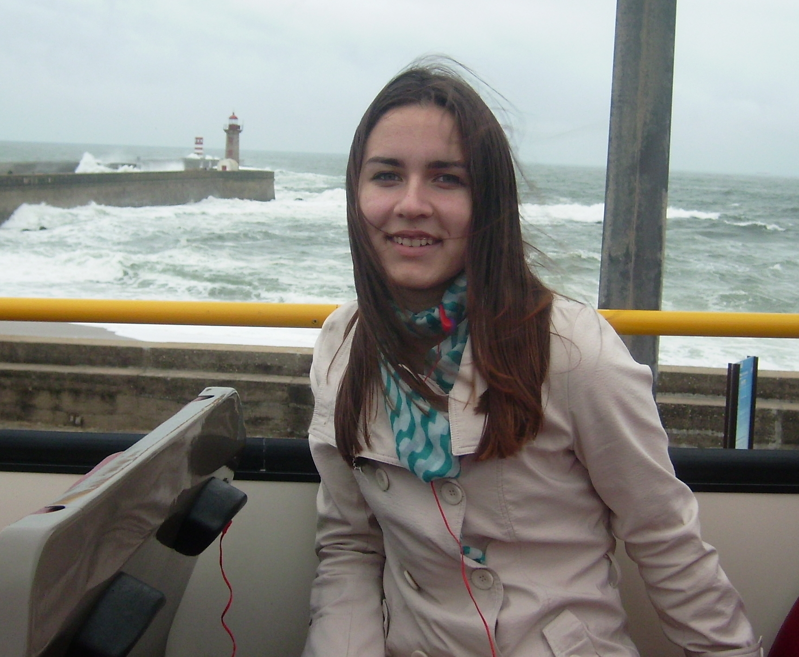

### CV
## **Anastasiya Boltutskaya**


*******************************************

## **Contacts**

**tel.number*: + 37529 8293868


**e-mail*: nastia1oskirko@gmail.com


**github*: anastasiyaBoltutskaya


**discord*: Настасья anastasiyaBoltutskaya

********************************************

## **About myself**

Graduated BrSTU in 2016 year in speciality "Heat and Gas Supply, Ventilation and Air Protection".
Have been working for 3 years an engineer in gassupply organization.
Intrested in web develompent, badminton, swimming.


********************************************

## **Skills**

1. Git
2. HTML&CSS
3. Basic knowledge of Python
4. PyCharm


********************************************

## **English level**

  B1

********************************************  
## **Code Example**

```
function mergeArrays(arr1, arr2) {
  let mergeArr = [...arr1, ...arr2];
  let setMerge = new Set(mergeArr);
  mergeArr=Array.from(setMerge);
  mergeArr.sort( (a, b) => a - b );
    return mergeArr;
}
    ```


